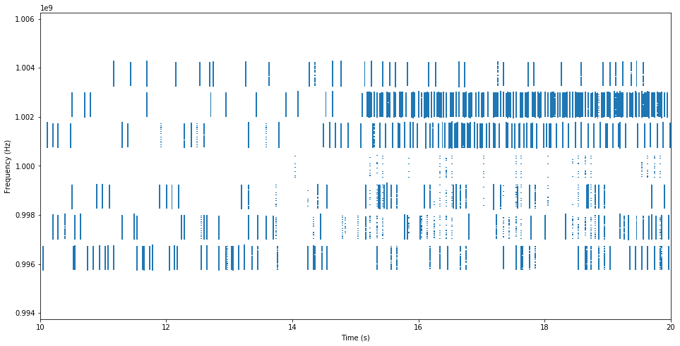
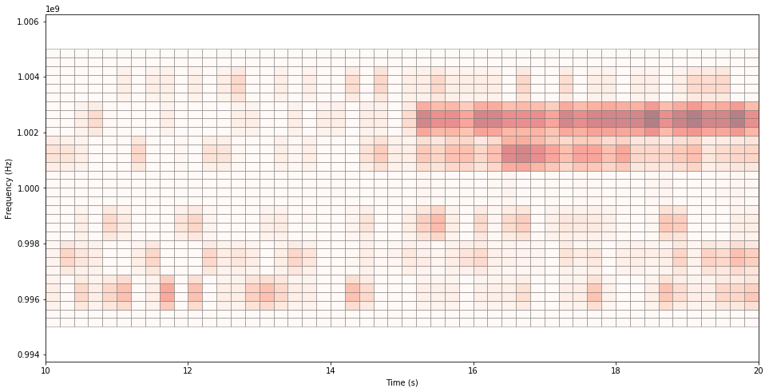
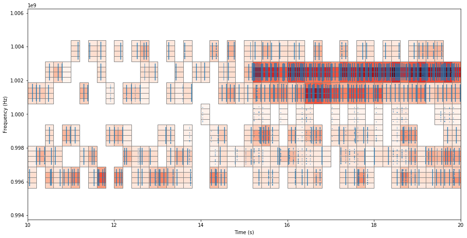

# sc2-spectrum-validation

## Table Of Contents
- [1. Introduction](#1-introduction)
- [2. Quantifying Accuracy](#2-quantifying-accuracy)
- [3. External Prediction Algorithm](#3-external-prediction-algorithm)
- [4. Theory of Operation](#4-theory-of-operation)
- [4.1 Recording and Post Processing RF Measurements](#41-recording-and-post-processing-rf-measurements)
- [4.2 Generating Predictions from RF](#42-generating-predictions-from-rf)
- [4.3 Parsing and Post Processing CIL Spectrum Usage Messages](#43-parsing-and-post-processing-cil-spectrum-usage-messages)


## 1. Introduction
This folder contains the code and supporting documentation for validation of spectrum usage messages.

The code assesses reports of historical usage and predictions of future usage.
* Historical reports are considered sufficiently accurate if they are better than a fixed threshold for each of the accuracy metrics defined below, when compared to measured RF transmissions by the network. The threshold is currently set to 50%.
* Predictions are considered sufficiently accurate if, when compared to measured RF transmissions, they are better for each of the accuracy metrics than an external predictor does when its output is compared to measured RF transmissions. The external predictor uses recent RF transmissions by the network to predict future spectrum usage with no a priori knowledge of network behavior.

The **[Quantifying Accuracy](#2-quantifying-accuracy)** section describes the metrics used to quantify the accuracy of spectrum use predictions and reports. The **[External Prediction Algorithm](#3-external-prediction-algorithm)** section introduces the baseline predictor and gives background references. Finally, the **[Theory of Operation](#4-theory-of-operation)** section walks through the details of spectrum usage validation, including RF ground truth processing, generating predictions, handling spectrum usage prediction updates, and scoring predictions and reports.


## 2. Quantifying Accuracy

Accuracy is quantified using three metrics described below.

The assessment currently ignores spatial location. The measurement process is equivalent to putting measurement antennas immediately next to each of the network's nodes, then summing those measurements before conducting the assessment.

The accuracy of the reported or predicted transmitted power is not currently assessed. The assessment considers only presence or absence of a transmitted signal. A signal is defined to be present if the power density exceeds the out-of-band threshold previously specified by DARPA.


### 2.1 Definitions
*   $`f_{start}, f_{stop}`$: Start and stop frequencies of a voxel.
*   $`t_{start}, t_{stop}`$: Start and stop timestamps of a voxel.
*   **Duty Cycle**: a number in the (0,1] range representing what fraction of time in a voxel is occupied by an active signal.
*   **Normalized Occupied Bandwidth (nobw)**: Like duty cycle, but in the frequency dimension. It represents what fraction of the frequencies in a voxel are occupied by an active signal.
*	**Reported “On”**: The portion of the reported or predicted spectrum voxel that has been declared to contain transmitted energy. This is computed as: $`(f_{stop} - f_{start} ) * (t_{stop} - t_{start}) * duty\_cycle * nobw`$.
*	**Occupied**: A time-bandwidth region of the spectrum where, in any subregion, the observer measures transmitted energy density exceeding the out-of-band power density.

Since CIL voxel reports do not include a field that maps to $`nobw`$, $`nobw`$ is currently set to a constant 1.0. The CIL Council may recommend a different approach.

Spectrum voxels with $`duty\_cycle = 0`$ or zero area are invalid and ignored. Any spectrum regions in those voxels are treated as outside of reported voxels.

### 2.2 Overlapping Voxels

When voxels overlap in time and frequency, they are coalesced using the following procedure.

1. Select a pair of voxels A and B that overlap

2. Remove them and replace them with a new voxel C defined as follows

3. Boundaries of C in frequency and time = union of A and B   (C may not be rectangular)

4. $`C_{report\_on}=A_{report\_on}+B_{report\_on}`$

5. Repeat steps 1-4 as needed  (C may be further coalesced with other voxels that overlap it)

### 2.3 Metrics

Each of the following metrics is defined in a way that works when voxel time and frequency bounds are arbitrarily specified but occupied region boundaries are quantized in time and frequency. The quantization is specified in the details section below.


* **In-voxel Error**
  - For each spectrum voxel, compute the area of intersection between the voxel and occupied spectrum. 
    Call this $`A_{tx\_inside}`$.
  - The metric is the total of the error in each voxel's occupancy report, normalized:

```math
E_i = \Big(\sum_{\mathrm{voxels}} \mathrm{abs}(A_{report\_on}-A_{tx\_inside})\Big)\Big/\mathrm{max}\Big(\sum_{\mathrm{voxels}} A_{tx\_inside}, \sum_{\mathrm{voxels}} A_{report\_on}\Big)
```

* **Out-of-voxel Error**
  - Define $`O`$ as the union of all occupied spectrum regions. Compute the area of this and call it $`A_{occupied}`$.
  - Define $`V`$ as the union of all valid reported voxels. 
    Take the difference (not symmetric difference) of $`V`$ from $`O`$, as defined at 
    http://geopandas.org/set_operations.html, to obtain only the parts of $`O`$ that do not intersect any part of $`V`$. 
    Compute the area of this and call it $`A_{tx\_outside}`$. 

  - The metric is the fraction of all occupied spectrum that is outside the reported voxels:

```math
E_o = A_{tx\_outside}\Big/A_{occupied}
```

Since these are error metrics, smaller is better. The required performance thresholds are:

   - historical:

```math
E_i<50\% \\
E_o<50\%
```

   - predicted:

```math
E_i<\mathrm{max}(10\%, E_i\mathrm{\ of\ the\ external\ prediction\ algorithm})\\
E_o<\mathrm{max}(10\%, E_o\mathrm{\ of\ the\ external\ prediction\ algorithm})
```


## 3. External Prediction Algorithm
The external prediction algorithm is implemented using a Vector Autoregression model (VAR). A vector autogregression model uses multiple sets of time series inputs to predict future values of those inputs. Wikipedia defines a VAR as:

A p-th order VAR, denoted **VAR(p)**, is

```math
y_{t}=c+A_{1}y_{t-1}+A_{2}y_{t-2}+\cdots +A_{p}y_{t-p}+e_{t}
```

where the observation $`y_{t−i}`$ (i periods back) is called the i-th **lag** of y, c is a k-vector of constants (intercepts), $`A_i`$ is a time-invariant (k × k)-matrix and $`e_t`$ is a k-vector of error terms satisfying

1. $`E(e_{t})=0`$ : every error term has mean zero;
2. $`E(e_{t}e_{t}')=\Omega`$ : the contemporaneous covariance matrix of error terms is Ω (a k × k positive-semidefinite matrix);
3. $`E(e_{t}e_{{t-k}}')=0`$ : for any non-zero k — there is no correlation across time; in particular, no serial correlation in individual error terms.

A pth-order VAR is also called a **VAR with p lags**.

See these links for more background:

*  https://otexts.com/fpp2/VAR.html
*  https://en.wikipedia.org/wiki/Vector_autoregression

The specific implementation used is from the PyFlux library: https://pyflux.readthedocs.io/en/latest/var.html?highlight=vector%20autoregression

### 3.1 Using the VAR Algorithm
To use the VAR algorithm, one firsts chooses the number of lags to model. A larger number of lags permits modelling more complex phenomena in the training data but comes at increased computational complexity.

The next step, once the number of lags has been chosen, is to fit the training data to a model. This will estimate the *c* and $`A_1`$ through $`A_p`$ terms from the **VAR(p)** equation.

With all the coefficient terms estimated, one can now use the model to generate predictions.

## 4. Theory of Operation

### 4.1 Recording and Post Processing RF Measurements
RF measurements of transmissions from a network are used in two ways for assessing accuracy of that network's spectrum usage reports:
* Ground Truth for determining accuracy of predictions and reports
* Training data for the external prediction algorithm, which is used to determine whether predictions by the network are sufficiently accurate

#### 4.1.1 RF Recorder: SC2 Observer
The spectrum prediction validation code in this repository assumes that RF transmissions are measured using the observer node described in https://gitlab.com/darpa-sc2-phase3/sc2-observer. Competitors may download this observer as a container via the SC2 LZ at **/share/nas/common/sc2observer\<version\>.tar.gz**

See https://gitlab.com/darpa-sc2-phase3/sc2-observer/blob/master/gr-sc2observer/apps/radio.conf for an example radio.conf file.

#### 4.1.2 SC2 Observer Outputs
The SC2 Observer generates two RF measurement files. The first is a coarse frequency resolution, high bandwidth file that covers a fixed 100 MHz of bandwidth centered at the scenario center frequency. This file is useful for debugging out-of-band emission issues.

The other file is a higher frequency resolution file focused on the scenario bandwidth. The bandwidth covered by this file can take on values from:

```math
\dfrac{100 \text{MHz}}{2^N}, N=\{1,2,3\}
```

The SC2 Observer will use the smallest value from that set that is greater than or equal to the specified scenario bandwidth. This high frequency resolution file has a fixed FFT size of 2048 bins and a framerate of 22 ms.

Complete documentation of the SC2 Observer, including config file specification, output file format specification, and example file reader implementation in GNU Radio can be found at https://gitlab.com/darpa-sc2-phase3/sc2-observer.

#### 4.1.3 Post Processing
Pixels of spectrum area used in computing the accuracy metrics are defined by the resolution of the SC2 observer high resolution file: 22 milliseconds by 1/2048 of the bandwidth covered in the file (see previous section).

 The first step in post processing is to generate a binary matrix with a 1 for each spectrum area pixel that is occupied and a 0 for each spectrum area pixel that is noise only. As defined earlier, a pixel is considered occupied if the measured power density exceeds the out of band threshold specified in the SC2 rules. An example of this matrix (1s shown in blue) is below.



### 4.2 Generating Predictions from RF

Training data: The VAR algorithm scales in computational complexity based on the number of inputs and the number of lags. Predicting spectrum usage for 2048 FFT bins at 22ms resolution would be unreasonably slow. To work around this, the matrix of occupied spectrum pixels is aggregated into a coarser grid. Associated with each element of the coarse grid is a real number $`D`$, the fraction of that grid element that was occupied. The below shows the coarse grid corresponding to the above occupied matrix. A more intense red color represents $`D`$ closer to 1.0:


The below image overlays the two previous figures. Grid elements with $`D`$ nearly 0.0 are forced to 0 and not outlined.



Generating predictions: The sequences of $`D`$ values for the preceding T1 seconds are loaded into the VAR model. Predictions not generated at startup when there is less than T1 seconds of previous observations. Predictions will be generated starting at time T1 seconds.

The coefficients are fitted using Ordinary Least Squares (OLS) estimation. The next T2 seconds worth of $`D`$ values are predicted. A predicted voxel is output for each predicted $`D`$ value that is higher than a minimum threshold. The frequency and time resolution of the predicted voxel corresponds to the coarse grid element, while the duty cycle of the predicted voxel is the predicted $`D`$ value.

The process is repeated from scratch at each time point. That is, there is no memory prior to T seconds and no memory of prior predictions.

If in the future the CIL council decides that voxels should separately report $`duty\_cycle`$ and $`nobw`$, the training and prediction process will be updated. To do this, the number of time sequences in the VAR model doubles, representing $`duty\_cycle`$ and $`nobw`$ for each coarse grid element. The model then separately predicts $`duty\_cycle`$ and $`nobw`$ for each future grid element.


### 4.3 Parsing and Post Processing CIL Spectrum Usage Messages

#### 4.3.1 Parsing and Filtering CIL Messages
CIL messages are parsed using the CIL Reader module from: 
https://gitlab.com/darpa-sc2-phase3/CIL/blob/master/tools/ciltool/ciltool/cil_reader.py

CIL messages are read in from CIL PCAP packet capture files. Each CIL PCAP file contains messages sent by the source team and messages received from outside sources, such as other teams.

In addition to the CIL message itself, the parsing code extracts the frame timestamp, source IP address, and destination IP address from each packet in the CIL PCAP file. The frame timestamp is the timestamp at which a packet was presented to the IP stack.

The code in this repository only validates CIL messages containing spectrum usage payloads. Furthermore, validation is only run on messages in a PCAP that were sent by the source team for that PCAP. Each source team's PCAP in a multi-team match should be validated independently. 

Messages are filtered down to include only messages sent by the source team by matching each message message packet's source IP address against the source team's gateway IP address. Messages with source IPs that do not match are ignored. 

Messages are filtered down to include only Spectrum Usage payloads by testing that the payload of the `CilMessage` object is a `SpectrumUsage` type using the `WhichOneof` method. Messages with other payload types are ignored.

#### 4.3.2 Sorting Predictions from Historical Usage
Spectrum Usage messages can reference historical spectrum usage or predicted spectrum usage. These two 
types of Spectrum Usage messages are processed and scored differently. Messages are assigned to the 
appropriate type as follows: 

- **Historical Usage**
  - Messages must have the `measured_data` flag of `SpectrumVoxelUsage` set to `true`
  - At least one voxel from `SpectrumUsage` must describe spectrum use occurring before the message's frame timestamp.
- **Predicted Usage**
  - Messages must have the `measured_data` flag of `SpectrumVoxelUsage` set to `false`
  - At least one voxel from `SpectrumUsage` must describe spectrum use occurring after the message's frame timestamp.

Messages that do not fit into either of the usage types above are ignored. 

#### 4.3.3 Post Processing Historical Usage Messages
Historical usage messages are post processed as follows.

- Messages with frame timestamps occurring before the official start of the match are ignored.
- Messages with frame timestamps occurring after the official end of the match are ignored.
- Voxels with zero area or zero duty cycle are ignored.
- Subsequent historical messages never invalidate previous historical messages. 
- When historical voxels from the same or different messages overlap in frequency and time, they are coalesced as described earlier.


#### 4.3.4 Post Processing Predicted Usage Messages
Predicted usage messages have a message update mechanism that allows for previous messages to be invalidated. This must
be accounted for in order to accurately score how well teams performed at spectrum usage prediction. Predicted usage
message post processing is handled as follows:

- Messages with frame timestamps occurring before the official start of the match are ignored.
- Messages with frame timestamps occurring after the official end of the match are ignored.
- Predicted usage messages are grouped by destination IP address.
- The minimum voxel time for a message is calculated as the minimum start time for any voxel in the message
- The start time of a message for the purpose of voxel validity is calculated as the max of the minimum voxel time and the message frame timestamp
- The stop time of a message for the purpose of voxel validity is defined as the start time of the "next" message, where the "next" message is the next message sent to the same destination IP as ordered by the frame timestamp.
- The geometry of each voxel is trimmed down to include only the time extent between the message start and stop validity times.
- Overlapping voxels in the same message are coalesced as described earlier.

Because the stop time of each voxel is trimmed to the start time of the next message, each time a network transmits predicted usage it must repeat all voxels that end after the transmission time and are still valid. When doing this, it is important to be careful about the duty cycle of the repeated voxel. The duty cycle is not modified when the voxel is trimmed. Therefore the duty cycle must accurately reflect the expected transmission occupancy of the remaining portion of the voxel. (More precisely, from the transmission time of the Spectrum Usage message to the stop time of the voxel or the transmission time of the next Spectrum Usage message, whichever is earlier).

